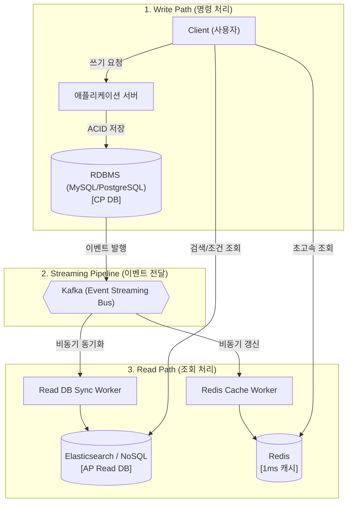

# CAP 정리부터 Kafka, CQRS, Redis까지: 분산 시스템 아키텍처 정리

빅데이터 및 분산 시스템을 공부하다 보면 CAP 정리부터 시작해 Kafka, Redis, CQRS 등 여러 개념과 기술이 쏟아져 나옵니다. 각각의 기술을 개별적으로 이해하는 것도 중요하지만, 실제 대규모 인프라에서 이들이 어떤 이유로 조합되어 작동하는지 전체적인 아키텍처 흐름을 파악하는 것이 더 중요합니다.

이번 글에서는 CAP 이론의 **P(Partition Tolerance)** 개념에서 출발하여, **RDBMS, CQRS, Kafka, Redis**가 하나의 대규모 분산 아키텍처 안에서 어떻게 역할을 나누어 처리되는지 정리해보았습니다.

- - -

## 1. CAP 정리에서 P(Partition Tolerance)의 명확한 의미

CAP 정리에서는 Consistency(일관성), Availability(가용성), Partition Tolerance(네트워크 단절 감내) 중 2가지만 선택할 수 있다고 말합니다.

여기서 **P(Partition Tolerance)**는 선택 가능한 옵션이라기보다, **분산 환경이라면 무조건 발생할 수밖에 없는 물리적 현실**을 의미합니다.

여러 대의 서버가 네트워크로 연결된 환경에서는 라우터 장애, 랜선 단절, 네트워크 타임아웃 등 통신 장애가 언젠가 반드시 일어납니다. 따라서 분산 시스템을 설계할 때는 "네트워크 단절(P)은 무조건 발생한다"는 전제를 두고, 장애 상황 시 **CP**와 **AP** 중 무엇을 우선시할지 결정하게 됩니다.

* **CP (Consistency + P)**: 네트워크 단절 시 일관성을 지키기 위해 **가용성을 포기**합니다. (데이터 불일치가 발생할 바에는 오류를 반환 $\rightarrow$ 결제, 금융, 재고 관리 등)
* **AP (Availability + P)**: 네트워크 단절 시 가용성을 지키기 위해 **일관성을 잠시 포기**합니다. (약간 과거 데이터라도 일단 응답을 제공 $\rightarrow$ SNS 좋아요, 피드, 상품 조회 등)

- - -

## 2. 정합성과 조회 성능을 모두 잡는 CQRS 패턴

결제처럼 엄격한 일관성이 필요한 기능과, 빠른 검색/조회가 필요한 기능을 하나의 DB로 처리하는 것은 어렵습니다. 이를 해결하기 위해 **쓰기(Write)와 읽기(Read) 저장소를 분리하는 CQRS(Command Query Responsibility Segregation) 패턴**을 사용합니다.


```mermaid
graph LR
    User["Client<br/>(사용자 요청)"]

    User -->|Write (생성/수정/삭제)| WriteModel["Write Model"]
    User -->|Read (조회)| ReadModel["Read Model"]

    subgraph Write_Layer ["Write 계층 (CP 특성)"]
        WriteModel --> RDBMS[("RDBMS (MySQL, PostgreSQL)<br/>- ACID 트랜잭션<br/>- 데이터 정합성 보장")]
    end

    subgraph Read_Layer ["Read 계층 (AP 특성)"]
        ReadModel --> ES["Elasticsearch<br/>- 역색인 초고속 검색"]
        ReadModel --> NoSQL[("MongoDB / DynamoDB<br/>- 비정규화 문서 빠른 조회")]
    end

    RDBMS -.->|Event / CDC 동기화| ES
    RDBMS -.->|Event / CDC 동기화| NoSQL

    classDef client fill:#f4f4f4,stroke:#333,stroke-width:2px;
    classDef write fill:#fff0f0,stroke:#ff6b6b,stroke-width:2px;
    classDef read fill:#f0f8ff,stroke:#4dabf7,stroke-width:2px;

    class User client;
    class WriteModel,RDBMS write;
    class ReadModel,ES,NoSQL read;
```

* **Write 계층 (CP)**: RDBMS를 활용하여 데이터의 정합성과 ACID 트랜잭션을 보장합니다.
* **Read 계층 (AP)**: 역색인(Inverted Index) 구조로 검색에 강한 **Elasticsearch**나, `JOIN` 연산 없이 문서를 빠르게 읽을 수 있는 **NoSQL(MongoDB 등)**을 활용합니다.

- - -

## 3. 데이터 흐름을 연결하는 Kafka의 역할

쓰기 DB와 읽기 DB가 분리되면, 쓰기 DB에 반영된 변경 사항을 읽기 DB로 전달해 주는 스트리밍 파이프라인이 필요합니다. 이 역할을 수행하는 것이 **Apache Kafka**입니다.

Kafka는 단순히 메시지를 중계하는 것을 넘어 디스크에 메시지를 순차적으로 저장(Append-Only Log)하는 이벤트 스트리밍 플랫폼입니다.

### 트래픽과 상관없이 Kafka가 제공하는 구조적 장점

1. **오프셋(Offset) 기반 장애 복구**: 컨슈머(읽기 서버)에 장애가 발생해 중단되더라도, 마지막으로 읽은 오프셋 위치가 남아있어 시스템 복구 후 유실 없이 이어서 처리할 수 있습니다.
2. **이벤트 재처리(Replayability)**: 데이터를 일정 기간(예: 7일) 디스크에 보관하므로, 로직 수정 시 과거 이벤트를 처음부터 다시 읽어 데이터 상태를 재구성할 수 있습니다.
3. **시스템 간 디커플링(Decoupling)**: Producer(발행자)와 Consumer(소비자)가 직접 통신하지 않으므로, 새로운 수집/분석 서비스가 추가되어도 기존 시스템에 영향을 주지 않습니다.

> 참고: 대용량 로그나 센서 데이터처럼 초당 무수한 쓰기 요청이 쏟아지는 경우에는 RDBMS 대신 **Kafka를 Write 입구(Buffer)로 바로 활용**하여 쓰기 부하를 흡수하기도 합니다.

- - -

## 4. Kafka와 Redis의 역할 구분

Kafka가 이미 데이터를 보관하고 전달하는데 Redis를 추가로 사용하는 것에 대해 과설계가 아닌지 의문이 들 수 있습니다. 하지만 두 기술은 목적이 다릅니다.

* **Kafka (파이프라인 / 이력 저장소)**: 시스템 간에 데이터를 순서대로 안전하게 전달하고 이벤트를 보관하는 역할
* **Redis (인메모리 캐시 / 실시간 상태)**: RAM 기반으로 작동하여 1ms 미만의 응답 속도로 대규모 읽기 요청을 직접 처리하는 역할

### 실무에서의 협업 예시

1. 쓰기 이벤트가 발생하면 RDBMS에 저장되고 **Kafka**로 이벤트가 발행됩니다.
2. Kafka 메시지를 구독하는 컨슈머가 **Redis**의 실시간 순위나 캐시 데이터를 업데이트합니다.
3. 대규모 읽기 요청이 들어오면 DB를 거치지 않고 **Redis에서 즉시 응답**을 반환합니다.

- - -

## 5. 전체 분산 시스템 아키텍처 흐름

이러한 요소들을 결합하면 다음과 같은 이벤트 기반 분산 시스템 아키텍처가 구성됩니다.



- - -

## 요약

* **P(Partition Tolerance)**는 분산 환경에서 피할 수 없는 전제 조건입니다.
* 데이터의 **정합성(Write)**은 RDBMS(CP)가 담당합니다.
* 데이터의 **빠른 조회(Read)**는 CQRS 패턴에 따라 NoSQL / Elasticsearch(AP)가 담당합니다.
* 두 레이어 간의 **이벤트 전달 및 장애 복구**는 Kafka가 담당합니다.
* 순간적인 **대규모 읽기 트래픽 방어**는 Redis가 담당합니다.
